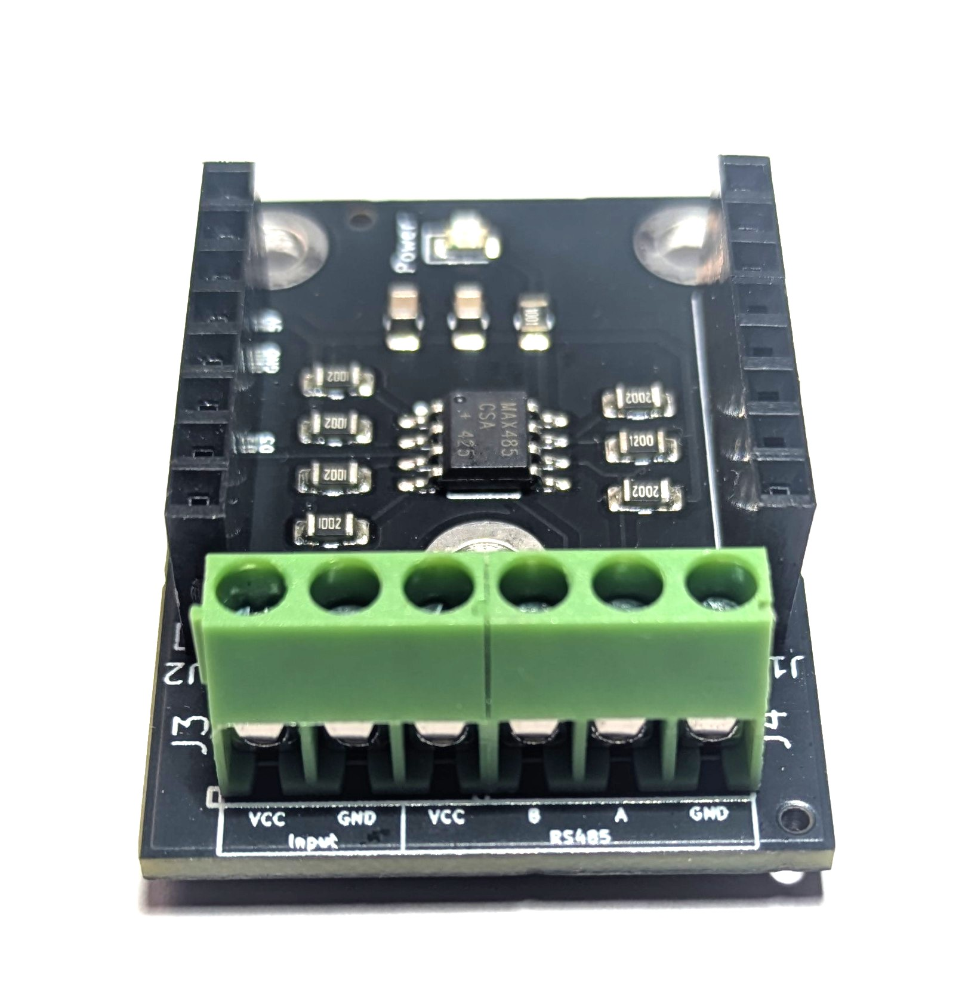
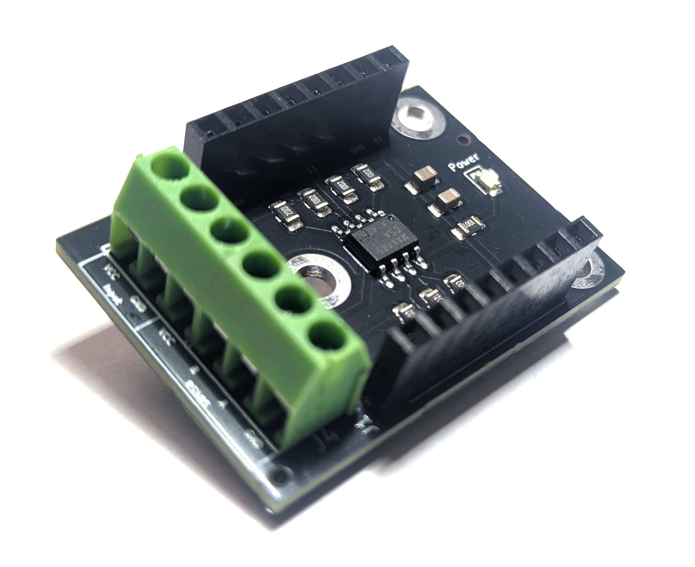
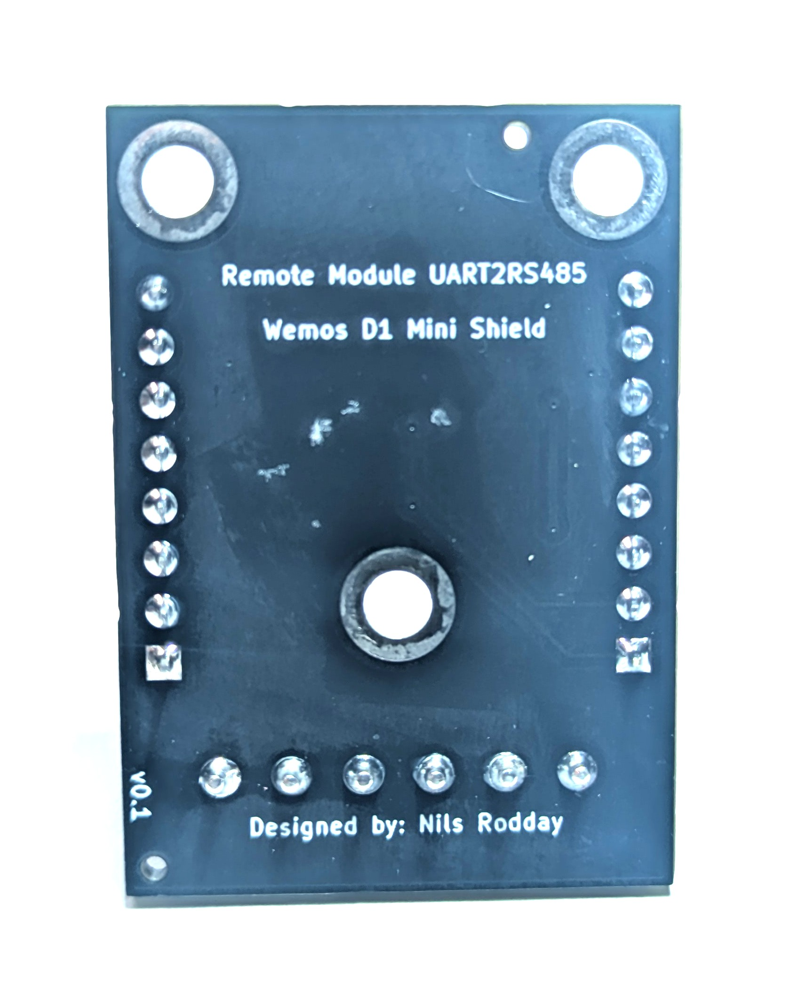
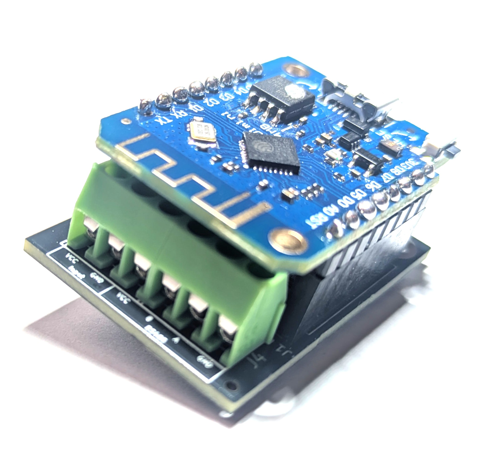

# Wemos D1 Mini Shield - UART to RS485

   

This repository contains the sample YAML file to use with the "Wemos D1 Mini Shield - UART to RS485" shield. 

In order to use the shield, follow the steps below:

1.1 Edit the following parameters to directly connect your Wemos D1 Mini upon boot to your Wifi network:
>WIFINAME
>
>WIFI_PASSWORD

1.2 (Optional) Edit the OTA_PASSWORD to allow Over-the-Air updates via Home Assistant, if necessary.

1.3 (Optional) Edit the AP_PASSWORD to connect to allow for remote connections to the AccessPoint of the Wemos D1 Mini in case the WiFi network from step 1.1 is not available.

1.4 Edit the BAUD rate, stop_bits, data_bits, and parity according to the device you wish to communicate with.

1.5 Edit the name of the device and address of the modbus registers you would like to read from or write to.

2 Attach your Wemos D1 Mini shield via USB to your computer and run ESPHome with the adjusted YAML file to flash your Wemos D1 Mini:
>esphome run UARTtoRS485.yaml

3 Once flashing is done, attach your Wemos D1 Mini to the shield (pay attention to the correct orientation, 5V PIN is indicated on the shield and on the Wemos D1 Mini or have a look at the product pictures) and provide 5V and Ground to the shield OR power the shield from the Wemos D1 Mini Micro-USB port. Do not connect both power sources at the same time!

HomeAssistant will detect a new ESPHome instance with the controls you specified (for example): 
HA Module UARTtoRS485 - YOUR CONTROL NAME

4. You can now read/write from/to the predefined registers of your device from HomeAssistant. E.g. if you read a sensor value every 60 seconds, it will be shown in HomeAssistant, or if you attach a write action to a button in your HomeAssistant GUI and push the button, the respective write action to your RS485 device will be executed.

